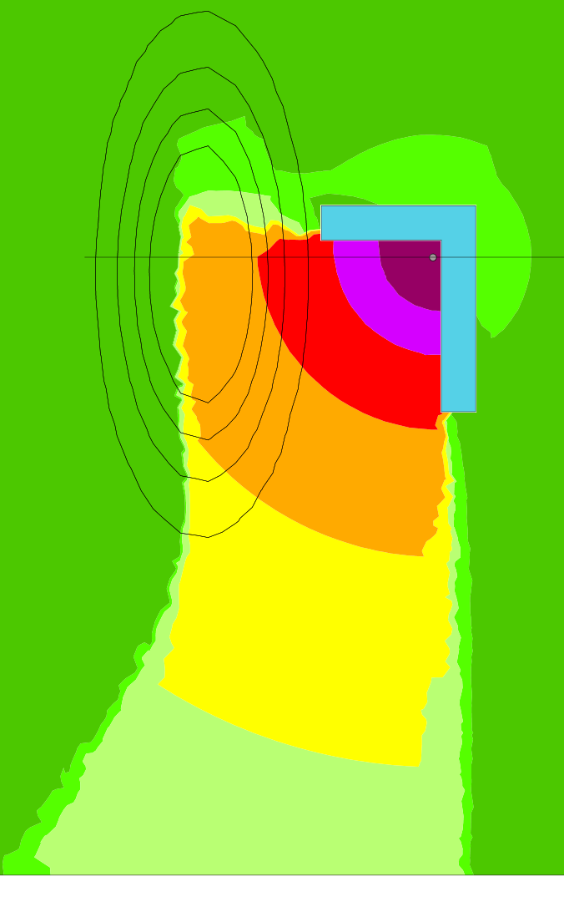

This document contain an example of how to create a vertical cut by generating a grid of receivers distributed over Z plane.

A hill is also created using Gaussian function.

You can skip the create scene part if you already have imported data.

## Create scene

```mysql
-- make buildings table
drop table if exists buildings;
create table buildings ( the_geom GEOMETRY, height double );
INSERT INTO buildings VALUES 
('MULTIPOLYGON (((80 -30 0,80 90 0,-10 90 0,-10 70 0,60 70 0,60 -30 0,80 -30 0)))',5);
drop table if exists sound_source;
create table sound_source(the_geom geometry, db_m100 double,db_m125 double,db_m160 double,db_m200 double,db_m250 double,db_m315 double,db_m400 double,db_m500 double,db_m630 double,
db_m800 double,db_m1000 double,db_m1250 double,db_m1600 double,db_m2000 double,db_m2500 double,db_m3150 double,db_m4000 double,db_m5000 double);
insert into sound_source VALUES ('POINT(55 60 1)', 100, 100, 100, 100, 100, 100, 100, 100, 100, 100, 100, 100, 100, 100, 100, 100, 100, 100);
INSERT INTO sound_source VALUES ('POINT( -300 -300 0 )',Log10(0),Log10(0),Log10(0),Log10(0),Log10(0),Log10(0),Log10(0),Log10(0),Log10(0),Log10(0),Log10(0),Log10(0),Log10(0),Log10(0),Log10(0),Log10(0),Log10(0),Log10(0));
INSERT INTO sound_source VALUES ('POINT( 500 500 0 )',Log10(0),Log10(0),Log10(0),Log10(0),Log10(0),Log10(0),Log10(0),Log10(0),Log10(0),Log10(0),Log10(0),Log10(0),Log10(0),Log10(0),Log10(0),Log10(0),Log10(0),Log10(0));
-- Create Digital elevation model using gaussian 2d function
drop table if exists all_dem;
SET @DOMAIN_XMIN = SELECT ST_XMIN(ST_EXTENT(THE_GEOM)) FROM SOUND_SOURCE;
SET @DOMAIN_XMAX = SELECT ST_XMAX(ST_EXTENT(THE_GEOM)) FROM SOUND_SOURCE;
SET @DOMAIN_YMIN = SELECT ST_YMIN(ST_EXTENT(THE_GEOM)) FROM SOUND_SOURCE;
SET @DOMAIN_YMAX = SELECT ST_YMAX(ST_EXTENT(THE_GEOM)) FROM SOUND_SOURCE;
SET @POINT_COUNT = 50; 
SET @MOUNTAIN_X = -80;
SET @MOUNTAIN_Y = 50;
SET @MONTAIN_WIDTH = 8;
SET @MOUNTAIN_LENGTH = 50;
create table all_dem(the_geom POINT,Z double as ST_Z(the_geom)) as select ST_MAKEPOINT(X * ((@DOMAIN_XMAX - @DOMAIN_XMIN) / @POINT_COUNT) + @DOMAIN_XMIN, Y * ((@DOMAIN_YMAX - @DOMAIN_YMIN) / @POINT_COUNT) + @DOMAIN_YMIN,
-- Gaussian
10 * EXP(-(POWER(X - ((@MOUNTAIN_X - @DOMAIN_XMIN) / (@DOMAIN_XMAX - @DOMAIN_XMIN) * @POINT_COUNT)  ,2) / @MONTAIN_WIDTH  + POWER(Y - ((@MOUNTAIN_Y - @DOMAIN_YMIN) / (@DOMAIN_YMAX - @DOMAIN_YMIN) * @POINT_COUNT) ,2) / @MOUNTAIN_LENGTH ))) the_geom,

null  from (select X from system_range(0,@POINT_COUNT)),(select X Y from system_range(0,@POINT_COUNT)) ;
select (-24 - @DOMAIN_XMIN) / (@DOMAIN_XMAX - @DOMAIN_XMIN) * @POINT_COUNT;
-- Remove dem point too close from buildings
drop table if exists dem;
create spatial index on buildings(the_geom);
create table dem as select d.the_geom, d.Z from all_dem d where (select COUNT(*) near from buildings b where d.the_geom && b.the_geom AND ST_DISTANCE(d.the_geom, b.the_geom) < 1) = 0;
```
## Create vertical receiver points positions
```mysql
SET @DOMAIN_XMIN = -148;
SET @DOMAIN_XMAX = 214;
SET @DOMAIN_YMIN = 60;
SET @DOMAIN_YMAX = 60;
SET @DOMAIN_ZMIN = 0;
SET @DOMAIN_ZMAX = 40;
SET @POINT_COUNT = 200; 
SET @POINT_ZCOUNT = 50; 

-- Creating table of receiver around the cut.
drop table if exists receivers_cut;
create table receivers_cut(gid serial, the_geom POINT,Z double as ST_Z(the_geom)) as select null,ST_MAKEPOINT(((@DOMAIN_XMAX - @DOMAIN_XMIN) * (XY/@POINT_COUNT)) + @DOMAIN_XMIN, (@DOMAIN_YMAX - @DOMAIN_YMIN) * (XY/@POINT_COUNT) + @DOMAIN_YMIN,(@DOMAIN_ZMAX - @DOMAIN_ZMIN) * (Z/@POINT_ZCOUNT) + @DOMAIN_ZMIN + CASEWHEN(XY % 2 = 0, 0, (@DOMAIN_ZMAX - @DOMAIN_ZMIN) / (@POINT_ZCOUNT * 2)::double)) the_geom, null  from (select X::double XY from system_range(0,@POINT_COUNT)),(select X::double Z from system_range(0,@POINT_ZCOUNT)) ;
-- Add grounds layer for illustration
drop table if exists building2d;
create table building2d as select 'POLYGON((60 0, 80 0, 80 5, 60 5, 60 0))'::geometry the_geom;

-- Creating the propagation line
drop table if exists propa_line;
create table propa_line as select ST_MAKELINE(ST_MAKEPOINT(@DOMAIN_XMIN, @DOMAIN_YMIN),ST_MAKEPOINT(@DOMAIN_XMAX, @DOMAIN_YMAX))  the_geom;

-- Creating the Delauney grid
drop table if exists grid_del, expl_grid;
create table grid_del as select ST_CONSTRAINEDDELAUNAY(ST_ACCUM(the_geom), 1) the_geom from dem;
create table expl_grid(the_geom LINESTRING, GID SERIAL) as select the_geom, EXPLOD_ID GID from ST_EXPLODE('GRID_DEL');
drop table if exists propa_line_inters;
create table propa_line_inters(the_geom POINT, GID SERIAL) as select ST_INTERSECTION(p.the_geom, l.the_geom) the_geom, GID from propa_line p, expl_grid l WHERE ST_INTERSECTS(p.the_geom, l.the_geom);
update propa_line_inters set the_geom = (SELECT ST_POINTN(ST_INTERPOLATE3DLINE(ST_MAKELINE(ST_POINTN(g.the_geom, 1),propa_line_inters.the_geom,ST_POINTN(g.the_geom, 2))), 2) from expl_grid g where g.GID = propa_line_inters.GID);
drop table if exists profil, source2D;
create table profil as select ST_MAKEPOLYGON(ST_MAKELINE(ST_MAKEPOINT(@DOMAIN_XMIN, @DOMAIN_ZMIN),ST_UNION(ST_ACCUM(the_geom)), ST_MAKEPOINT(@DOMAIN_XMIN, @DOMAIN_ZMIN))) the_geom from (select ST_MAKEPOINT(ST_X(the_geom), ST_Z(the_geom)) the_geom from propa_line_inters order by ST_X(the_geom));
create table source2D as select ST_MAKEPOINT(ST_X(the_geom), ST_Z(the_geom)) the_geom from sound_source;
```

## Do sound propagation
-- Generating sound propagation level on receivers
```sql
drop table if exists RECEIVER_LVL;
create table RECEIVER_LVL as select * from BR_PTGRID3D('BUILDINGS','HEIGHT','SOUND_SOURCE','RECEIVERS_CUT','DB_M','','DEM',750,50,2,1,0.23);
```
## Create noise map
-- Generating table of the noise map
```mysql
drop table if exists receiver_cloud,delaun;
create table receiver_cloud(the_geom POINT) as select ST_MAKEPOINT(ST_X(the_geom), ST_Z(the_geom), W) the_geom from RECEIVER_LVL A JOIN RECEIVERS_CUT B ON A.GID = B.GID;
-- delaunay fail if scan line starts with multiple points
insert into receiver_cloud values ((SELECT ST_UPDATEZ(ST_TRANSLATE(ST_POINTN(ST_TOMULTILINE(ST_EXTENT(the_geom)),1),-1,1),0) from receiver_cloud));
create table delaun as select ST_DELAUNAY(ST_ACCUM(the_geom)) the_geom from receiver_cloud;
drop table if exists tri_lvl,tricontouring_noise_map;
create table tri_lvl as select * from ST_EXPLODE('delaun');
create table tricontouring_noise_map AS SELECT * from ST_TriangleContouring('TRI_LVL',31622, 100000, 316227, 1000000, 3162277, 1e+7, 31622776, 1e+20);
-- Merge adjacent triangle into polygons (multiple polygon by row, for unique isoLevel and cellId key)
-- Merge triangle together to reduce the number of rows
drop table if exists multipolygon_iso;
create table multipolygon_iso as select IDISO, ST_UNION(ST_ACCUM(the_geom)) THE_GEOM FROM tricontouring_noise_map GROUP BY IDISO;
-- Explode each row to keep only a polygon by row
drop table if exists contouring_noise_map;
create table contouring_noise_map as select the_geom,idiso from ST_Explode('MULTIPOLYGON_ISO');
-- Remove intermediate tables
drop table if exists ALL_DEM, BUILDINGS, DELAUN, DEM, EXPL_GRID, GRID_DEL, MULTIPOLYGON_ISO, PROPA_LINE, PROPA_LINE_INTERS, RECEIVERS_CUT, RECEIVER_CLOUD, RECEIVER_LVL, SOUND_SOURCE, TRICONTOURING_NOISE_MAP;
```
## Result

You can download the style in the SE 2.0 here :
[NFS-31-130.se](styles/NFS-31-130.se "NFS 31-130")

[](images/cut_direct.png)

_Direct field_

[](images/cut_vdiff.png)

_Direct field + Diffraction on horizontal edges_

[](images/cut_vdiff_ref.png)

_Direct field + Diffraction on horizontal edges + specular reflection_



_Top view, black line is vertical cut_